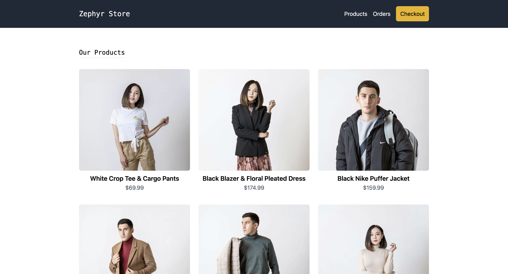
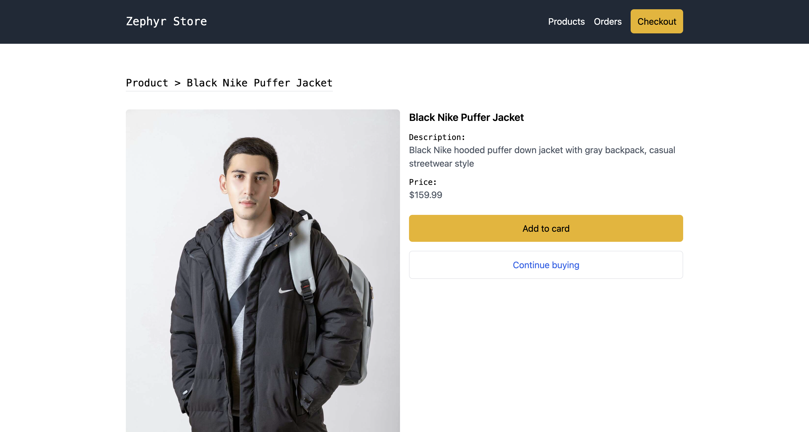

## App Description

The app that I built is a simple e-commerce application that allows users to browse a list of items, add them to a cart, simulate a checkout process, create and check their orders.

### Home Page

### Product Page

I tried to think in an app where I could use the benefits of a microfrontend architecture to split the app into smaller and independent applications, for better scalability and maintainability.

I also cared about the user experience and the design of the app working on the app responsiveness, performance, SEO and accessibility.

### Features
In the app, the user can:
- View a list of items.
- View details of a specific item.
- Add new items to the cart.
- Remove items from the cart.
- View the total price of items in the cart.
- Simulate a payment.
- Create an order with the items in the cart.
- View a list of orders.

## My main changes

I followed the module federation documentation and used the command `pnpm create module-federation@latest` to start my project using a template with `React + Webpack + Module Federation`. 

Before starting coding, I installed and configured the following tools:
- Typescript for type checking.
- Tailwind CSS for styling.
- Zustand for state management.
- React Router for navigation.
- Local Storage to persist data across sessions.
- React Icons for adding icons to the UI.
- Playwright for end-to-end testing.

I also created a `start:dev` script in the `package.json` that uses the `webpack.dev.js` config file without deploying the app to Zephyr Cloud during the development mode.

## Folder Structure
The folder structure of the app is organized as follows:
- app1 -> host app (main layout, navigation and state management)
- app2 -> remote (checkout page)
- app3 -> remote (orders page)

The host application (app1) is responsible for rendering the main layout, navigation and state management, while the remote applications (app2 and app3) handle specific functionalities related to the checkout process and order management, respectively.

The app1 also shares its global state with the remote apps2 and app3, allowing them to access and manipulate the cart and orders data with instant updates across all applications.

## Design Patterns and Best Practices

Since it was a simple and small app, I didn't spend too much time on the design patterns but I followed some best practices in React development, such as:
- Reusable and modular components for the different parts of the app.
- Usage of hooks for managing state and side effects.
- Usage of a global state management.
- Usage of css variables and utility classes from Tailwind CSS for styling.
- Usage of playwright for end-to-end testing.

## My experience
Building this app was challenging but also fun and rewarding. I worked on a microfrontend app once before but everything was setup by someone else, so this time I had to start from scratch and make all the decisions regarding the architecture and the tools to use. 

The integration with Zephyr Cloud is very smooth and fast, everything is deployed instantly with zero config, I used to use ngrok and vercel for deploying and sharing a preview link with my collegues before. It's very interesting how zephyr manages the remote dependencies automatically.

For what I understood, the zephyr webpack plugin captures the built files and sends them to the cloud, making them available as packages to be consumed by other microfrontends. Under the root it manages the remote dependencies based in the zephyr:dependencies in the package.json file.

I tried to setup a ci/cd pipeline with github actions to run e2e tests to make sure everything is working but I had some issues with the configuration and I couldn't make it work yet, so I decided to focus on the development of the app and leave the ci/cd setup for later. The .github/workflows/playwright.yml file is commented.

During the development I also had a few issues that I had to solve:
- Out of date links in the warnings and errors of webpack.
 - https://module-federation.io/guide/troubleshooting/runtime/RUNTIME-008 -> https://module-federation.io/guide/troubleshooting/runtime#runtime-008
- Circular reference between the apps causing an infinite loop.
- Out of sync state management and mutiple instances between apps.
